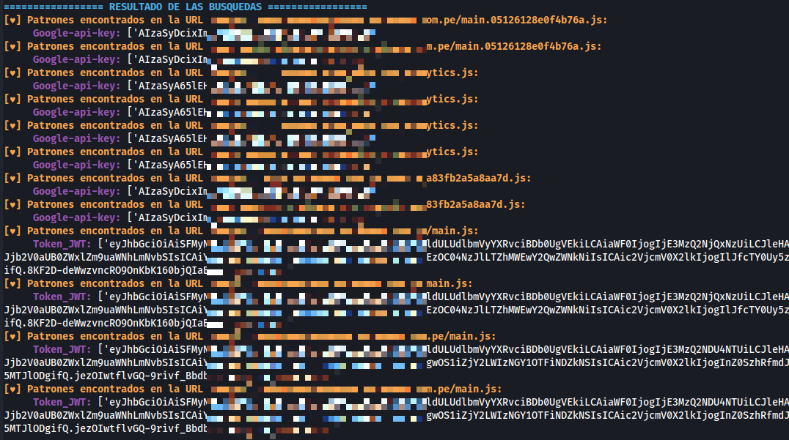

# JS-CredentialScanner
# Proyecto de Búsqueda de Archivos JS y Patrones

Script en Python para la búsqueda automatizada de archivos JavaScript en páginas web, diseñado para identificar y extraer patrones clave como claves de API y tokens. Utiliza técnicas de scraping y expresiones regulares para encontrar credenciales expuestas. El proceso consiste en dos partes principales:
1. Buscar archivos `.js` en las URLs proporcionadas.
2. Buscar patrones específicos en el contenido de las páginas y los archivos `.js` encontrados.

## Características

- **Búsqueda de Archivos JS**: Se obtienen las URLs de los archivos `.js` desde páginas HTML.
- **Búsqueda de Patrones Específicos**: Se buscan patrones específicos dentro del contenido de las páginas, como claves de API, tokens JWT, cadenas de autorización, entre otros.
- **Ejecución en Paralelo**: El proceso de búsqueda se realiza en paralelo utilizando `ThreadPoolExecutor` para mejorar la eficiencia.

## Requisitos

Este proyecto requiere Python 3 y las siguientes bibliotecas:

- `requests`
- `beautifulsoup4`
- `colorama`

Puedes instalar todas las dependencias necesarias ejecutando el siguiente comando:

```bash
pip install -r requirements.txt
```
## Modo de uso




## Notas
- La herramienta busque los siguientes patrones por defecto; pero puede agregar nuevos patrones para una busqueda mas exhaustiva.
```bash
patrones_busqueda = {
    "Conexion_aks": r"DefaultEndpointsProtocol=https;AccountName=[^;]+;AccountKey=[^;]+;EndpointSuffix=core\.windows\.net",
    "Token_JWT": r"eyJ[a-zA-Z0-9_-]*\.[a-zA-Z0-9_-]*\.[a-zA-Z0-9_-]*",
    "Google-api-key": r"(?i)AIza[0-9A-Za-z\-_]{35}",
    "Authorization-Basic": r"(?i)(Authorization:\sbasic\s+[a-z0-9=:_\-+/]{5,100})",
    "Authorization-Bearer": r"(?i)(Authorization:\sbearer\s+[a-z0-9=:_\-\.+/]{5,100})",
}
```
